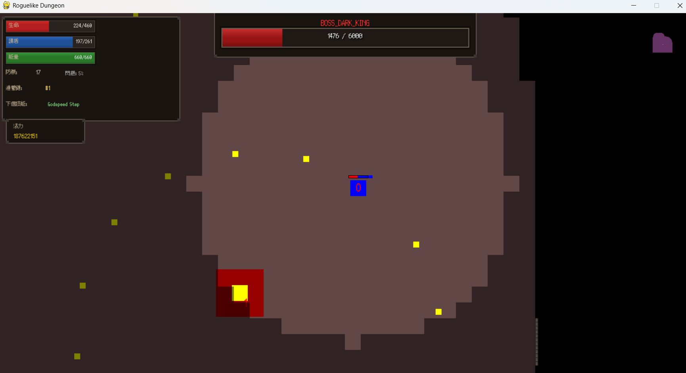
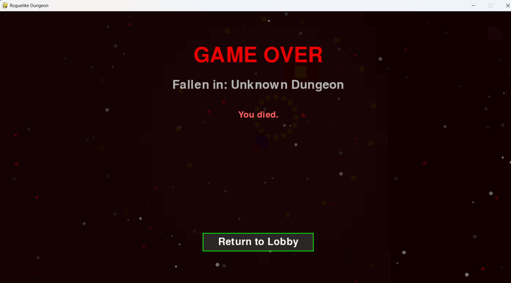
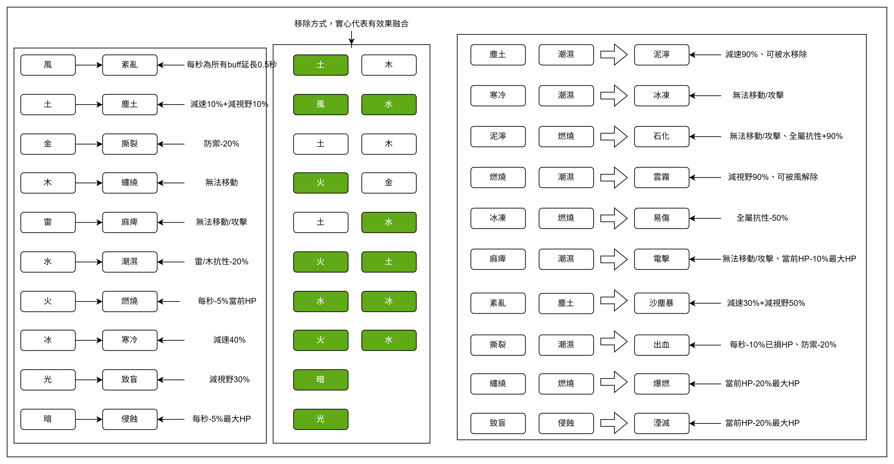

# ⚗️ Alchemy RPG Game

[](https://github.com/jui-pixel/aoop_2025_group12_Alchmey_RPG_game/actions)

> **AOOP 2025 Group 12 專案成果** > 一款結合隨機副本、屬性煉金與即時戰鬥的 Roguelike RPG 遊戲。

 

### Canva : [LINK](<https://www.canva.com/design/DAG8sHiuRyA/4Z5ffgRHJUHJcNM1A6CJuA/edit?utm_content=DAG8sHiuRyA&utm_campaign=designshare&utm_medium=link2&utm_source=sharebutton>)
---

## 📖 專案概述

**Alchemy RPG** 是一款基於 Pygame 開發的動作角色扮演遊戲。玩家將探索由 BSP 演算法生成的隨機地圖，收集元素材料，透過煉金鍋合成獨特的魔法技能與增益詞條。

本專案融合了現代軟體工程實踐，採用 **物件導向設計 (OOP)**、**ECS 架構**，並導入 **CI/CD 自動化流程** 與 **單元測試**，確保開發品質與部署效率。

### ✨ 核心特色

* **🗺️ 隨機副本生成 (Roguelike)**：利用 BSP (二元空間分割) 等演算法生成獨一無二的地圖結構，確保每次冒險都是全新體驗。
    * **⚙️ 資料驅動設計 (Data-Driven)**：透過修改 `dungeon_flow.json` 設定檔即可定義地牢層級、生成參數與關卡流程，實現高度可配置化的遊戲內容設計。
* **🧪 屬性交互與煉金系統**：
    * **合成機制**：透過煉金鍋將基礎元素合成高級技能（如：魔法飛彈、護盾）。
    * **詞條增幅**：自由搭配傷害、穿透、減傷等增益效果。
* **⚔️ 即時戰鬥與 AI**：包含多樣化的敵人行為樹與具備獨特功能的 NPC（魔法水晶、交易商人）。
* **🕸️ 跨平台支援**：
    * **本機版**：基於 Pygame，提供流暢體驗。
    * **網頁版**：透過 Pygbag 與 GitHub Actions 自動部署，點擊即玩。
    * **線上體驗**：[👉 點擊這裡立即遊玩 (Play Now)](https://jui-pixel.github.io/aoop_2025_group12_Alchmey_RPG_game/)

---

## 🛠️ 技術棧 (Tech Stack)

| 類別 | 技術 / 工具 | 說明 |
| :--- | :--- | :--- |
| **核心語言** | Python 3.12+ | 主要開發語言 |
| **遊戲引擎** | Pygame (CE) | 渲染、輸入與音效處理 |
| **Web 運行** | Pygbag / Pyodide | 將 Python 遊戲編譯為 WebAssembly |
| **架構模式** | OOP / ECS / Manager Pattern / | 實體元件系統，降低耦合度 |
| **自動化 CI/CD** | GitHub Actions | 自動化測試 (Pytest)、Linting (Flake8)、部署 |
| **程式碼品質** | Flake8, Pytest | 符合 PEP 8 規範與單元測試覆蓋 |
| **版本控制** | Git / GitHub | 協作與版控 |

---

## 🎮 遊戲操作 (Controls)

| 按鍵 | 功能 |
| :---: | :--- |
| **W / A / S / D** | 移動角色 |
| **滑鼠左鍵** | 使用技能 |
| **滑鼠滾輪 / 數字鍵 1-9** | 切換技能鍊 |
| **E** | 與 NPC 互動 / 開啟技能選單 |
| **ESC** | 開啟暫停選單 |
---

## 🕹️ 遊玩指南 (Gameplay Guide)

### 1. 冒險據點 (The Lobby)
遊戲開始時，玩家將身處於整備大廳。這裡是通往冒險的起點，包含四位關鍵 NPC 與訓練設施：

| NPC / 設施 | 位置與外觀 | 功能說明 |
| :--- | :--- | :--- |
| **🔮 魔法水晶** | 左上 (白色) | **角色成長核心**。提供等級提升、屬性覺醒、技能庫查詢與增幅效果檢視。 |
| **⚗️ 煉金鍋** | 左下 (棕色) | **技能合成台**。投入三種基底與選擇 11 種屬性，加入增幅劑後可合成獨一無二的技能並為其命名。 |
| **💰 交易商** | 中間 (藍綠色) | **資源補給**。消耗魔力 (Mana) 進行生命值恢復與物資交易。 |
| **🎯 訓練假人** | 右下 (灰白色) | **傷害測試**。不會反擊的木樁，供玩家測試技能傷害與連招手感。 |
| **🌀 傳送門** | 右上 (紫色) | **副本入口**。通往隨機生成的危險地牢進行挑戰。 |

### 2. 屬性與戰鬥系統 (Combat System)
本遊戲擁有深度的屬性克制與狀態異常機制，掌握這些知識是通關的關鍵。

#### 屬性克制表
不同的元素之間存在相剋關係，攻擊克制屬性的敵人可造成額外傷害。


#### 屬性狀態異常
各屬性攻擊有機率觸發特殊的狀態效果（如燃燒、凍結、麻痺等）。



### 3. 地牢探索與挑戰 (Dungeon & Enemies)
在隨機生成的副本中，你將遭遇到不同的機遇與挑戰：

* **🎁 命運寶箱 (Gold)**：互動後開啟轉盤 (Roulette) 機制，運氣將決定你獲得強力獎勵裝備或是遭遇詛咒。
* **⚔️ 一般敵人 (Green)**：地牢中的原生怪物，擊敗它們以獲取經驗與煉金素材。
* **🌀 傳送門 (Purple)**：該地牢的終點，按下 **`E`** 鍵互動可通往下一層進行挑戰。
* **🚪 脫離點 (Pink)**：該次地牢的最終終點，按下 **`E`** 鍵互動可結算獎勵並安全撤離。

### ☠️ 區域魔王 (The Boss)
地牢深處潛藏著強大的守護者（中心金色、外圍紅色光環）。
* **多階段戰鬥**：Boss 擁有 **3 個狂暴階段**，隨著血量下降，攻擊模式將變得更加兇猛。
* **複雜 AI**：具備 **15 種攻擊動作** 與 **18 種連招 (Combo)** 模式，考驗玩家的走位與反應。


---
## 🚀 環境設置與執行

### 先決條件
* Python 3.12 或更高版本
* Git

### 1. 克隆專案
```bash
git clone https://github.com/jui-pixel/aoop_2025_group12_Alchmey_RPG_game.git
cd aoop_2025_group12_Alchmey_RPG_game
```

### 2. 建立虛擬環境 (推薦)

為了保持環境乾淨，建議使用 venv：

```bash
# Windows
python -m venv venv
.\venv\Scripts\activate

# macOS/Linux
python3 -m venv venv
source venv/bin/activate
```

### 3. 安裝依賴

```bash
pip install -r requirements.txt
```

### 4. 啟動遊戲

```bash
python main.py
```

---

## 📂 專案結構

本專案採用模組化設計，核心邏輯位於 `src/` 目錄下

```text
alchemy-rpg-game/
├── .github/workflows/            # CI/CD 自動化流程 (包含 deploy.yml)
├── assets/                       # 遊戲資產庫 (圖片、音效、字體)
├── src/                          # 遊戲核心源碼
│   ├── core/                     # 核心邏輯 (Game Loop, Global Config)
│   ├── dungeon/                  # 隨機地圖生成系統 (核心特色)
│   │   ├── algorithms/           # 生成演算法 (BSP, Graph)
│   │   ├── builder/              # 地圖建構器
│   │   └── generators/           # 房間與走廊生成邏輯
│   ├── ecs/                      # ECS 架構核心 (Components, Systems)
│   ├── entities/                 # 實體定義 (Player, Enemy, NPC)
│   ├── manager/                  # 系統管理器 (Audio, Event, Render)
│   ├── menu/                     # 選單系統
│   ├── skills/                   # 技能邏輯
│   └── utils/                    # 通用工具
├── tests/                        # 單元測試
├── main.py                       # 遊戲啟動入口
├── requirements.txt              # Python 依賴清單
├── classes_Alchmey_RPG_game.png  # 類別圖
├── packages_Alchmey_RPG_game.png # 依賴圖
└── player_data.json              # 玩家存檔

```

---

## 📜 許可證與致謝

### 致謝 (Credits)

* **ECS Framework**: [esper](https://github.com/benmoran56/esper) by benmoran56
* **Game Assets**: [itch.io](https://itch.io/) (Assets sources)

### 許可證

本專案採用 **MIT License** 開源許可。詳見 [LICENSE](https://github.com/jui-pixel/aoop_2025_group12_Alchmey_RPG_game/blob/main/LICENSE) 文件。
