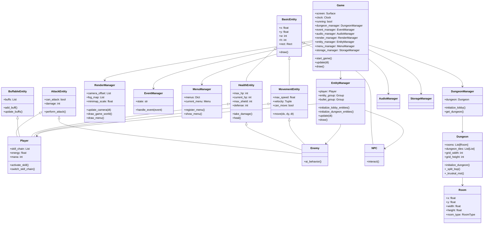

# Architecture Review & Optimization Plan

## Class Diagram

## Optimization Suggestions

### 1. Architecture Refactoring (架構重構)

*   **Entity Component System (ECS)**:
    *   **Current Issue**: The project uses deep inheritance and mixins (`Player` inherits from 4 classes). This leads to the "Diamond Problem" and makes the code rigid and hard to extend.
    *   **Suggestion**: Transition to an Entity Component System (ECS). Entities should be simple IDs, and data (Health, Position, Sprite) should be Components. Systems (MovementSystem, RenderSystem) should handle the logic. Libraries like `esper` can help.
    *   **Benefit**: Greater flexibility, easier to add new features without breaking existing class hierarchies.

*   **State Pattern for Game States**:
    *   **Current Issue**: `EventManager` uses string comparisons (`if state == "lobby"`) to manage game flow.
    *   **Suggestion**: Implement a proper State Pattern. Create an abstract `GameState` class with `enter()`, `exit()`, `update()`, and `draw()` methods. Subclasses like `LobbyState`, `PlayingState`, `MenuState` would handle specific logic.
    *   **Benefit**: Cleaner code, easier to manage complex state transitions.

*   **Decoupling with Event Bus**:
    *   **Current Issue**: Managers hold direct references to `Game` and each other, creating tight coupling.
    *   **Suggestion**: Implement an Event Bus (Observer Pattern). Managers subscribe to events (e.g., `PLAYER_DIED`, `ROOM_ENTERED`) and react accordingly without direct dependencies.

### 2. Performance Optimization (效能優化)

*   **Spatial Partitioning (空間分割)**:
    *   **Current Issue**: Collision detection and rendering likely iterate through all entities.
    *   **Suggestion**: Implement a Quadtree or Spatial Hash Grid. This allows querying only nearby entities for collision and rendering.
    *   **Benefit**: Significant performance boost when entity count increases.

*   **Render Culling (渲染剔除)**:
    *   **Current Issue**: The `RenderManager` might be processing entities that are off-screen.
    *   **Suggestion**: Implement Frustum Culling. Only draw entities and tiles that are within the camera's view.

*   **Asset Management**:
    *   **Current Issue**: Ensure assets (images, sounds) are loaded once and cached.
    *   **Suggestion**: Verify `ResourceManager` caches loaded assets efficiently to avoid I/O lag during gameplay.

### 3. Code Quality & Maintainability (代碼品質與維護性)

*   **Separation of Concerns in Dungeon Generation**:
    *   **Current Issue**: The `Dungeon` class mixes data storage (tiles, rooms) with generation logic (BSP, MST).
    *   **Suggestion**: Extract generation logic into a `DungeonGenerator` class. `Dungeon` should only hold the map data.
    *   **Benefit**: Easier to test and swap generation algorithms.

*   **Configuration & Constants**:
    *   **Current Issue**: Hardcoded strings (e.g., 'Outside', 'Room_floor') are scattered.
    *   **Suggestion**: Use Python `Enum` for Tile Types, Room Types, and Game States.
    *   **Benefit**: Prevents typos and makes refactoring easier.

*   **Type Hinting**:
    *   **Suggestion**: Continue improving type hints and use static analysis tools like `mypy` to catch errors early.

### 4. Gameplay Systems (遊戲系統)

*   **Input Handling Abstraction**:
    *   **Suggestion**: Create an `InputManager` that maps physical keys to logical actions (e.g., `ACTION_ATTACK`, `ACTION_MOVE_UP`).
    *   **Benefit**: Allows for easy key remapping and gamepad support.

*   **Data-Driven Design**:
    *   **Suggestion**: Move entity stats, skill data, and item properties to external JSON/YAML files instead of hardcoding them in Python classes.
    *   **Benefit**: Allows game designers to tweak balance without touching code.
