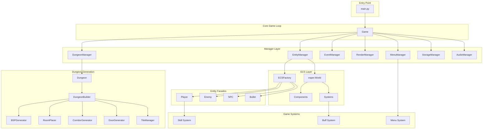
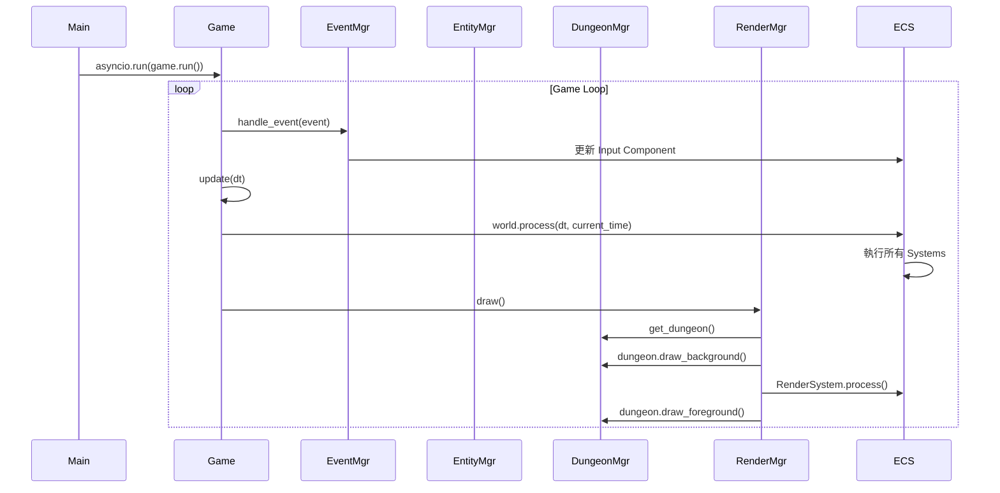
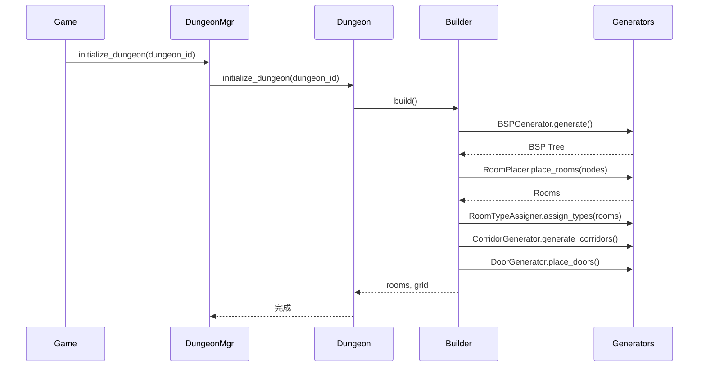
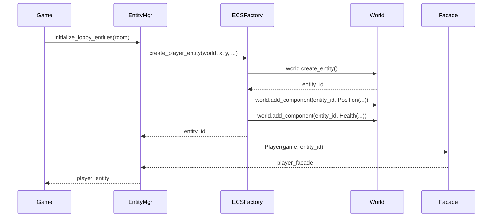

# Roguelike Dungeon 專案優化分析報告

> **生成日期**: 2025-12-20  
> **專案**: Alchemy RPG - Roguelike Dungeon Game  
> **架構**: ECS (Entity Component System) + Manager Pattern

---

## 📋 目錄

1. [專案概述](#專案概述)
2. [專案架構圖](#專案架構圖)
3. [核心模組分析](#核心模組分析)
4. [檔案用途與交互關係](#檔案用途與交互關係)
5. [優化建議](#優化建議)
6. [具體優化步驟](#具體優化步驟)

---

## 專案概述

### 技術棧
- **遊戲引擎**: Pygame
- **ECS 框架**: Esper
- **語言**: Python 3.12+
- **架構模式**: ECS + Manager Pattern + Facade Pattern

### 主要功能
- ✅ BSP 演算法隨機副本生成
- ✅ ECS 實體組件系統
- ✅ 屬性交互與煉金系統
- ✅ 多樣化敵人與 NPC
- ✅ 技能鏈系統
- ✅ 菜單管理系統
- 🚧 多人連線（計畫中）
- 🚧 網頁版部署（計畫中）

---

## 專案架構圖



---

## 核心模組分析

### 1. 遊戲核心 (Core)

#### 📄 `main.py`
**用途**: 遊戲入口點
- 初始化 Pygame
- 創建遊戲實例
- 啟動異步遊戲循環

**交互**:
```
main.py → Game.run()
```

#### 📄 `src/game.py`
**用途**: 遊戲主控制器
- 管理遊戲狀態 (menu, lobby, playing, win)
- 協調所有 Manager
- 處理遊戲主循環 (update/draw)

**核心屬性**:
```python
- screen: pygame.Surface
- clock: pygame.time.Clock
- world: esper.World (ECS)
- state: str (遊戲狀態)
- 7個 Manager 實例
- player_entity: int (玩家 ECS 實體 ID)
```

**交互**:
```
Game → DungeonManager (地牢管理)
Game → EntityManager (實體管理)
Game → EventManager (事件處理)
Game → RenderManager (渲染)
Game → MenuManager (菜單)
Game → StorageManager (存檔)
Game → AudioManager (音效)
```

#### 📄 `src/config.py`
**用途**: 全局配置常數
- 地牢生成參數
- 顏色定義
- 遊戲常數 (FPS, 螢幕尺寸)
- 可通行瓦片定義

---

### 2. Manager 層

#### 📄 `src/dungeon_manager.py`
**用途**: 地牢生命週期管理
- 初始化大廳/副本
- 管理當前房間
- 提供房間切換接口

**核心方法**:
```python
+ initialize_lobby()
+ initialize_dungeon(dungeon_id)
+ get_current_room()
+ switch_room(new_room_id)
```

**交互**:
```
DungeonManager → Dungeon (持有)
DungeonManager ← Game (被調用)
DungeonManager ← EntityManager (查詢房間信息)
```

#### 📄 `src/entity_manager.py`
**用途**: ECS 實體管理器
- 封裝 esper.World
- 初始化大廳/副本實體
- 提供實體查詢接口

**核心方法**:
```python
+ initialize_lobby_entities(room)
+ initialize_dungeon_entities()
+ clear_entities()
+ get_interactable_entities()
+ get_player_component()
```

**交互**:
```
EntityManager → esper.World (操作)
EntityManager → ECSFactory (創建實體)
EntityManager → Player/Enemy/NPC Facade (創建)
EntityManager ← Game (被調用)
```

#### 📄 `src/event_manager.py`
**用途**: 輸入事件處理
- 根據遊戲狀態分發事件
- 處理玩家移動/攻擊/交互
- 技能切換邏輯

**核心方法**:
```python
+ handle_event(event)
- _handle_menu_event(event)
- _handle_lobby_event(event)
- _handle_playing_event(event)
- _handle_interaction()
```

**交互**:
```
EventManager → MenuManager (菜單事件)
EventManager → Player (玩家操作)
EventManager → EntityManager (查詢可交互實體)
EventManager ← Game.update() (被調用)
```

#### 📄 `src/render_manager.py`
**用途**: 渲染管理
- 攝影機跟隨
- 小地圖繪製
- 視野迷霧 (FOV)
- UI 繪製 (血條、能量條)

**核心方法**:
```python
+ update_camera(dt)
+ draw_game_world()
+ draw_menu()
+ draw_lobby()
+ draw_playing()
- _draw_minimap()
- _draw_fog()
- _draw_ui()
```

**交互**:
```
RenderManager → Dungeon.draw_background/foreground()
RenderManager → RenderSystem.process() (ECS 渲染)
RenderManager → MenuManager.draw()
RenderManager ← Game.draw() (被調用)
```

#### 📄 `src/menu_manager.py`
**用途**: 菜單堆疊管理
- 菜單註冊
- 菜單推入/彈出 (堆疊模式)
- 事件分發給頂層菜單

**核心方法**:
```python
+ register_menu(name, menu)
+ push_menu(menu_name)
+ pop_menu()
+ get_current_menu()
+ handle_event(event)
+ draw()
```

**交互**:
```
MenuManager → AbstractMenu (管理多個)
MenuManager ← Game.show_menu/hide_menu()
MenuManager ← EventManager (事件處理)
```

#### 📄 `src/storage_manager.py`
**用途**: 玩家數據持久化
- 技能庫管理
- 玩家屬性存檔
- 覺醒元素管理
- JSON 序列化/反序列化

**核心方法**:
```python
+ load_from_json()
+ save_to_json()
+ add_skill_to_library(skill_dict)
+ get_skill_instance(name)
+ apply_stats_to_player()
+ apply_skills_to_player()
+ awaken_element(element, cost)
```

**交互**:
```
StorageManager → Player (應用數據)
StorageManager ← Game (初始化時載入)
StorageManager ← Menu (技能選擇時更新)
```

#### 📄 `src/audio_manager.py`
**用途**: 音效管理
- BGM 播放/停止
- SFX 播放
- 音量控制

---

### 3. 地牢生成模組

#### 📄 `src/dungeon/dungeon.py`
**用途**: 地牢狀態管理與門面
- 持有地牢配置
- 管理房間列表
- 提供繪製接口
- 委派生成邏輯給 DungeonBuilder

**核心屬性**:
```python
+ config: DungeonConfig
+ rooms: List[Room]
+ grid: List[List[str]]
+ builder: DungeonBuilder
+ tile_manager: TileManager
+ background_tileset: Dict
+ foreground_tileset: Dict
```

**核心方法**:
```python
+ initialize_dungeon(dungeon_id)
+ initialize_lobby()
+ draw_background(screen, camera_offset)
+ draw_foreground(screen, camera_offset)
+ get_tile(x, y)
+ is_passable(x, y)
```

**交互**:
```
Dungeon → DungeonBuilder (委派生成)
Dungeon → TileManager (瓦片操作)
Dungeon → Room (持有多個)
Dungeon ← DungeonManager (被管理)
Dungeon ← RenderManager (繪製)
```

#### 📄 `src/dungeon/builder/dungeon_builder.py`
**用途**: 地牢生成協調器
- 協調所有生成器
- 執行生成流程
- 生成統計信息

**生成流程**:
```
1. BSPGenerator → 生成 BSP 樹
2. RoomPlacer → 在葉節點放置房間
3. RoomTypeAssigner → 分配房間類型
4. GraphAlgorithms → 建立 MST
5. CorridorGenerator → 生成走廊
6. DoorGenerator → 放置門
7. TileManager → 調整牆壁
```

**交互**:
```
DungeonBuilder → BSPGenerator
DungeonBuilder → RoomPlacer
DungeonBuilder → RoomTypeAssigner
DungeonBuilder → CorridorGenerator
DungeonBuilder → DoorGenerator
DungeonBuilder → TileManager
DungeonBuilder → Room (創建)
DungeonBuilder ← Dungeon (被調用)
```

#### 📄 `src/dungeon/algorithms/bsp_generator.py`
**用途**: BSP 樹生成
- 遞歸分割空間
- 創建 BSPNode 樹

#### 📄 `src/dungeon/generators/room_placer.py`
**用途**: 房間放置
- 在 BSP 葉節點放置房間
- 應用偏移與隨機性

#### 📄 `src/dungeon/generators/room_type_assigner.py`
**用途**: 房間類型分配
- 根據關卡配置分配房間類型
- 設置起始/終點房間

#### 📄 `src/dungeon/generators/corridor_generator.py`
**用途**: 走廊生成
- 連接房間
- 使用 A* 尋路

#### 📄 `src/dungeon/generators/door_generator.py`
**用途**: 門放置
- 在房間與走廊交界處放置門

#### 📄 `src/dungeon/managers/tile_manager.py`
**用途**: 瓦片網格管理
- 瓦片讀寫
- 牆壁調整 (凹凸角)
- 可通行性檢查

#### 📄 `src/dungeon/config/config_loader.py`
**用途**: 關卡配置載入器
- 從 JSON 載入關卡配置
- 解析怪物池配置
- 保存配置

#### 📄 `src/dungeon/config/level_config.py`
**用途**: 關卡配置數據類
- LevelConfig
- MonsterConfig
- MonsterPoolConfig

#### 📄 `src/dungeon/room.py`
**用途**: 房間數據結構
- 房間位置、尺寸
- 房間類型
- 瓦片網格
- 連接關係

---

### 4. ECS 架構

#### 📄 `src/ecs/components.py`
**用途**: ECS 組件定義
- Position, Velocity, Health, Defense
- Combat, Renderable, Input, Collider
- AI, Buffs, PlayerComponent
- NPCInteractComponent
- ProjectileState, ExpansionLifecycle

#### 📄 `src/ecs/systems.py`
**用途**: ECS 系統實現
- MovementSystem (移動與碰撞)
- RenderSystem (渲染實體)
- InputSystem (輸入處理)
- HealthSystem (傷害計算)
- BuffSystem (Buff 管理與合成)
- CollisionSystem (碰撞檢測)
- AISystem (敵人 AI)
- ProjectileSystem (子彈邏輯)
- ExpansionSystem (擴散圓邏輯)
- EnergySystem (能量回復)

**交互**:
```
Systems → Components (查詢與修改)
Systems ← esper.World.process() (每幀執行)
```

#### 📄 `src/ecs/ai.py`
**用途**: AI 行為樹與上下文
- EnemyContext (AI 決策上下文)
- 行為樹節點定義

#### 📄 `src/entities/ecs_factory.py`
**用途**: ECS 實體工廠
- 創建玩家實體
- 創建敵人實體
- 創建 NPC 實體
- 創建子彈實體

**核心方法**:
```python
+ create_player_entity(world, x, y, tag, game)
+ create_enemy1_entity(world, x, y, game, tag, ...)
+ create_alchemy_pot_npc(world, x, y, w, h, tag, ...)
+ create_dungeon_portal_npc(world, x, y, w, h, ...)
+ create_magic_crystal_npc(world, x, y, w, h, tag, ...)
+ create_dummy_entity(world, x, y, w, h, tag, game)
```

---

### 5. Entity Facade 層

#### 📄 `src/entities/player/player.py`
**用途**: 玩家 Facade
- 封裝玩家 ECS 實體
- 提供高層接口 (技能、移動、屬性)
- 技能鏈管理

**核心方法**:
```python
+ add_skill_to_chain(skill, chain_idx)
+ switch_skill_chain(chain_idx)
+ activate_skill(direction, current_time, target_position)
+ add_buff(buff)
+ 屬性訪問器 (x, y, hp, energy, etc.)
```

**交互**:
```
Player → PlayerComponent (技能鏈)
Player → Combat, Health, Defense (戰鬥屬性)
Player → Position, Velocity (移動)
Player ← EventManager (操作)
Player ← StorageManager (應用數據)
```

#### 📄 `src/entities/enemy/enemy1.py`
**用途**: 敵人 Facade
- 封裝敵人 ECS 實體
- AI 行為觸發

#### 📄 `src/entities/npc/*.py`
**用途**: NPC Facade
- AlchemyPotNPC (煉金鍋)
- DungeonPortalNPC (副本傳送門)
- MagicCrystalNPC (魔法水晶)
- Dummy (訓練假人)

---

### 6. 技能與 Buff 系統

#### 📄 `src/skills/abstract_skill.py`
**用途**: 技能抽象基類

#### 📄 `src/skills/shoot_skill.py`
**用途**: 射擊技能
- 創建子彈實體
- 設置子彈屬性

#### 📄 `src/skills/buff_skill.py`
**用途**: Buff 技能
- 應用 Buff 到玩家

#### 📄 `src/buffs/buff.py`
**用途**: Buff 抽象基類

#### 📄 `src/buffs/element_buff.py`
**用途**: 元素 Buff
- 燃燒、潮濕、泥濘等

---

### 7. 菜單系統

#### 📄 `src/menu/abstract_menu.py`
**用途**: 菜單抽象基類

#### 📄 `src/menu/menus/*.py`
**用途**: 具體菜單實現
- StatMenu (屬性升級)
- AmplifierChooseMenu (增幅劑選擇)
- SkillChainMenu (技能鏈管理)
- SkillChainEditMenu (技能鏈編輯)
- SkillLibraryMenu (技能庫)
- SettingsMenu (設置)
- NamingMenu (命名)

---

## 檔案用途與交互關係

### 核心交互流程圖



### 地牢生成流程



### 實體初始化流程



---

## 優化建議

### 🔴 高優先級優化

#### 1. **性能優化**

##### 問題 1.1: ECS 系統執行順序未優化
**現況**: 所有系統每幀無條件執行
**影響**: CPU 浪費、幀率下降
**優化**:
```python
# 當前 (game.py)
self.world.process(dt, current_time)  # 執行所有系統

# 優化後
# 根據遊戲狀態選擇性執行系統
if self.state == 'playing':
    self.world.process(dt, current_time)
elif self.state == 'lobby':
    # 只執行必要系統
    self.world._process_system(MovementSystem, dt, current_time)
    self.world._process_system(RenderSystem, dt, current_time)
```

##### 問題 1.2: 渲染未進行視錐剔除優化
**現況**: 繪製所有實體，即使不在螢幕內
**影響**: GPU 浪費
**優化**: 在 RenderSystem 中添加視錐剔除

##### 問題 1.3: 地牢繪製未優化
**現況**: 每幀繪製整個地牢網格
**影響**: 大地圖時性能下降
**優化**: 
- 使用 Surface 緩存靜態瓦片
- 只繪製攝影機範圍內的瓦片

#### 2. **架構優化**

##### 問題 2.1: Manager 與 ECS 職責重疊
**現況**: EntityManager 既管理 ECS World 又持有 Facade
**影響**: 職責不清、難以維護
**優化**:
```python
# 建議架構
EntityManager → 純粹管理 esper.World
FacadeManager → 管理 Facade 實例 (Player, Enemy, NPC)
```

##### 問題 2.2: Game 類過於龐大
**現況**: Game 類有 300+ 行，職責過多
**影響**: 難以測試、難以擴展
**優化**: 拆分為 GameStateManager

##### 問題 2.3: 配置硬編碼
**現況**: config.py 混合常數與配置
**影響**: 難以調整、無法熱重載
**優化**: 使用 JSON/YAML 配置文件

#### 3. **代碼質量優化**

##### 問題 3.1: 缺少類型提示
**現況**: 部分函數缺少類型提示
**影響**: IDE 支持差、易出錯
**優化**: 添加完整類型提示

##### 問題 3.2: 缺少單元測試
**現況**: 無測試覆蓋
**影響**: 重構風險高
**優化**: 添加 pytest 測試

##### 問題 3.3: 缺少文檔字符串
**現況**: 部分類/方法缺少 docstring
**影響**: 難以理解
**優化**: 補充文檔

### 🟡 中優先級優化

#### 4. **功能優化**

##### 問題 4.1: 存檔系統簡陋
**現況**: 單一 JSON 文件
**影響**: 無多存檔、無自動保存
**優化**: 
- 多存檔槽
- 自動保存
- 存檔版本管理

##### 問題 4.2: 技能系統擴展性差
**現況**: 技能類型硬編碼
**影響**: 新增技能需修改多處
**優化**: 
- 技能配置化 (JSON)
- 技能熱重載

##### 問題 4.3: AI 系統簡單
**現況**: 簡單的行為樹
**影響**: 敵人行為單調
**優化**: 
- 更複雜的行為樹
- 狀態機
- 群體 AI

#### 5. **資源管理優化**

##### 問題 5.1: 資源載入無緩存
**現況**: 重複載入圖片/音效
**影響**: 記憶體浪費、載入慢
**優化**: 
- 資源管理器
- 資源池
- 預載入

##### 問題 5.2: 無資源釋放機制
**現況**: 切換場景時未釋放資源
**影響**: 記憶體洩漏
**優化**: 
- 場景切換時清理資源
- 弱引用

### 🟢 低優先級優化

#### 6. **用戶體驗優化**

##### 問題 6.1: 無載入畫面
**現況**: 生成地牢時畫面凍結
**影響**: 用戶體驗差
**優化**: 添加載入進度條

##### 問題 6.2: 無設置持久化
**現況**: 設置未保存
**影響**: 每次重啟需重新設置
**優化**: 保存設置到文件

##### 問題 6.3: 無教學系統
**現況**: 新手難以上手
**影響**: 學習曲線陡峭
**優化**: 添加教學關卡

---

## 具體優化步驟

### 階段 1: 性能優化 (1-2 週)

#### Step 1.1: 渲染優化
```python
# 文件: src/render_manager.py

def draw_game_world(self):
    """優化後的繪製流程"""
    dungeon = self.game.dungeon_manager.get_dungeon()
    
    # 1. 計算可見區域
    camera_x, camera_y = self.camera_offset
    visible_x_start = max(0, int(camera_x // TILE_SIZE) - 1)
    visible_y_start = max(0, int(camera_y // TILE_SIZE) - 1)
    visible_x_end = min(dungeon.width, int((camera_x + SCREEN_WIDTH) // TILE_SIZE) + 1)
    visible_y_end = min(dungeon.height, int((camera_y + SCREEN_HEIGHT) // TILE_SIZE) + 1)
    
    # 2. 只繪製可見瓦片
    dungeon.draw_background(
        self.screen, 
        self.camera_offset,
        visible_x_start, visible_y_start,
        visible_x_end, visible_y_end
    )
    
    # 3. 視錐剔除實體
    self._render_visible_entities()
    
    dungeon.draw_foreground(
        self.screen, 
        self.camera_offset,
        visible_x_start, visible_y_start,
        visible_x_end, visible_y_end
    )

def _render_visible_entities(self):
    """只渲染可見實體"""
    camera_x, camera_y = self.camera_offset
    render_system = self.game.world.get_processor(RenderSystem)
    
    for ent, (pos, rend) in self.game.world.get_components(Position, Renderable):
        # 視錐剔除
        if not self._is_visible(pos, rend, camera_x, camera_y):
            continue
        
        # 繪製實體
        render_system.draw_entity(self.screen, ent, pos, rend, self.camera_offset)

def _is_visible(self, pos, rend, camera_x, camera_y):
    """檢查實體是否在螢幕內"""
    screen_x = pos.x - camera_x
    screen_y = pos.y - camera_y
    
    return (
        -rend.w < screen_x < SCREEN_WIDTH + rend.w and
        -rend.h < screen_y < SCREEN_HEIGHT + rend.h
    )
```

#### Step 1.2: ECS 系統優化
```python
# 文件: src/game.py

def update(self, dt: float):
    """優化後的更新邏輯"""
    # 根據狀態選擇性執行系統
    if self.state == 'playing':
        self._update_playing(dt)
    elif self.state == 'lobby':
        self._update_lobby(dt)
    elif self.state == 'menu':
        self._update_menu(dt)

def _update_playing(self, dt: float):
    """遊戲中的更新"""
    current_time = pygame.time.get_ticks() / 1000.0
    
    # 執行所有遊戲系統
    self.world.process(dt, current_time)
    
    # 更新攝影機
    self.render_manager.update_camera(dt)

def _update_lobby(self, dt: float):
    """大廳的更新 (只執行必要系統)"""
    current_time = pygame.time.get_ticks() / 1000.0
    
    # 只執行移動、輸入、渲染系統
    for system_type in [InputSystem, MovementSystem, RenderSystem]:
        processor = self.world.get_processor(system_type)
        if processor:
            processor.process(dt, current_time, self)
    
    self.render_manager.update_camera(dt)

def _update_menu(self, dt: float):
    """菜單的更新 (不執行 ECS 系統)"""
    self.menu_manager.update_current_menus(dt)
```

#### Step 1.3: 地牢繪製緩存
```python
# 文件: src/dungeon/dungeon.py

class Dungeon:
    def __init__(self, config: Optional[DungeonConfig] = None):
        # ... 現有代碼 ...
        
        # 新增: 靜態瓦片緩存
        self._background_cache: Optional[pygame.Surface] = None
        self._cache_dirty = True
    
    def draw_background(self, screen, camera_offset, 
                       x_start=None, y_start=None, 
                       x_end=None, y_end=None):
        """優化後的背景繪製"""
        # 如果緩存失效，重新生成
        if self._cache_dirty:
            self._regenerate_background_cache()
            self._cache_dirty = False
        
        # 只繪製可見區域
        if x_start is None:
            x_start, y_start = 0, 0
            x_end, y_end = self.width, self.height
        
        # 從緩存中 blit 可見區域
        source_rect = pygame.Rect(
            x_start * TILE_SIZE,
            y_start * TILE_SIZE,
            (x_end - x_start) * TILE_SIZE,
            (y_end - y_start) * TILE_SIZE
        )
        
        dest_pos = (
            x_start * TILE_SIZE - camera_offset[0],
            y_start * TILE_SIZE - camera_offset[1]
        )
        
        screen.blit(self._background_cache, dest_pos, source_rect)
    
    def _regenerate_background_cache(self):
        """重新生成背景緩存"""
        cache_width = self.width * TILE_SIZE
        cache_height = self.height * TILE_SIZE
        self._background_cache = pygame.Surface((cache_width, cache_height))
        
        # 繪製所有背景瓦片到緩存
        for y in range(self.height):
            for x in range(self.width):
                tile_type = self.grid[y][x]
                if tile_type in self.background_tileset:
                    tile_image = self.background_tileset[tile_type]
                    self._background_cache.blit(
                        tile_image,
                        (x * TILE_SIZE, y * TILE_SIZE)
                    )
```

### 階段 2: 架構重構 (2-3 週)

#### Step 2.1: 拆分 Game 類
```python
# 新文件: src/game_state_manager.py

class GameStateManager:
    """遊戲狀態管理器"""
    
    def __init__(self, game: 'Game'):
        self.game = game
        self.state = 'menu'
        self.previous_state = None
        
        # 狀態處理器映射
        self._state_handlers = {
            'menu': self._handle_menu_state,
            'lobby': self._handle_lobby_state,
            'playing': self._handle_playing_state,
            'win': self._handle_win_state
        }
    
    def change_state(self, new_state: str):
        """切換遊戲狀態"""
        if new_state not in self._state_handlers:
            raise ValueError(f"Unknown state: {new_state}")
        
        self.previous_state = self.state
        self.state = new_state
        
        # 狀態切換回調
        self._on_state_exit(self.previous_state)
        self._on_state_enter(new_state)
    
    def update(self, dt: float):
        """根據當前狀態更新遊戲"""
        handler = self._state_handlers.get(self.state)
        if handler:
            handler(dt)
    
    def _handle_menu_state(self, dt: float):
        """處理菜單狀態"""
        self.game.menu_manager.update_current_menus(dt)
    
    def _handle_lobby_state(self, dt: float):
        """處理大廳狀態"""
        current_time = pygame.time.get_ticks() / 1000.0
        
        # 只執行必要系統
        for system_type in [InputSystem, MovementSystem, RenderSystem]:
            processor = self.game.world.get_processor(system_type)
            if processor:
                processor.process(dt, current_time, self.game)
        
        self.game.render_manager.update_camera(dt)
    
    def _handle_playing_state(self, dt: float):
        """處理遊戲中狀態"""
        current_time = pygame.time.get_ticks() / 1000.0
        self.game.world.process(dt, current_time)
        self.game.render_manager.update_camera(dt)
    
    def _handle_win_state(self, dt: float):
        """處理勝利狀態"""
        pass
    
    def _on_state_enter(self, state: str):
        """進入狀態時的回調"""
        if state == 'lobby':
            self.game.dungeon_manager.initialize_lobby()
            room = self.game.dungeon_manager.get_current_room()
            self.game.entity_manager.initialize_lobby_entities(room)
        elif state == 'playing':
            self.game.render_manager.reset_minimap()
            self.game.render_manager.reset_fog()
    
    def _on_state_exit(self, state: str):
        """離開狀態時的回調"""
        if state == 'lobby' or state == 'playing':
            self.game.entity_manager.clear_entities()

# 修改 src/game.py
class Game:
    def __init__(self, screen, clock):
        # ... 現有代碼 ...
        
        # 新增: 狀態管理器
        self.state_manager = GameStateManager(self)
    
    def update(self, dt: float):
        """簡化後的更新邏輯"""
        # 事件處理
        for event in pygame.event.get():
            if event.type == pygame.QUIT:
                return False
            self.event_manager.handle_event(event)
        
        # 委派給狀態管理器
        self.state_manager.update(dt)
        
        return True
    
    @property
    def state(self):
        return self.state_manager.state
    
    @state.setter
    def state(self, value):
        self.state_manager.change_state(value)
```

#### Step 2.2: 配置系統重構
```python
# 新文件: src/config_manager.py

import json
from pathlib import Path
from typing import Dict, Any

class ConfigManager:
    """配置管理器 - 支持熱重載"""
    
    def __init__(self, config_dir: str = "config"):
        self.config_dir = Path(config_dir)
        self._configs: Dict[str, Any] = {}
        self._file_timestamps: Dict[str, float] = {}
    
    def load_config(self, config_name: str) -> Dict[str, Any]:
        """載入配置文件"""
        config_path = self.config_dir / f"{config_name}.json"
        
        if not config_path.exists():
            raise FileNotFoundError(f"Config file not found: {config_path}")
        
        with open(config_path, 'r', encoding='utf-8') as f:
            config = json.load(f)
        
        self._configs[config_name] = config
        self._file_timestamps[config_name] = config_path.stat().st_mtime
        
        return config
    
    def get_config(self, config_name: str) -> Dict[str, Any]:
        """獲取配置 (自動重載)"""
        if config_name not in self._configs:
            return self.load_config(config_name)
        
        # 檢查文件是否修改
        config_path = self.config_dir / f"{config_name}.json"
        current_mtime = config_path.stat().st_mtime
        
        if current_mtime > self._file_timestamps[config_name]:
            print(f"Config {config_name} changed, reloading...")
            return self.load_config(config_name)
        
        return self._configs[config_name]
    
    def save_config(self, config_name: str, config: Dict[str, Any]):
        """保存配置文件"""
        config_path = self.config_dir / f"{config_name}.json"
        
        with open(config_path, 'w', encoding='utf-8') as f:
            json.dump(config, f, indent=2, ensure_ascii=False)
        
        self._configs[config_name] = config
        self._file_timestamps[config_name] = config_path.stat().st_mtime

# 創建配置文件: config/game.json
{
  "screen": {
    "width": 1400,
    "height": 750,
    "fps": 60
  },
  "dungeon": {
    "room_width": 20,
    "room_height": 20,
    "grid_width": 120,
    "grid_height": 100,
    "min_room_size": 15,
    "max_split_depth": 6
  },
  "player": {
    "max_weapon_chains": 9,
    "max_weapon_chain_length": 5,
    "base_hp": 100,
    "base_speed": 200
  }
}

# 修改 src/game.py
class Game:
    def __init__(self, screen, clock):
        # 載入配置
        self.config_manager = ConfigManager()
        self.game_config = self.config_manager.get_config('game')
        
        # 使用配置
        self.screen = screen
        self.clock = clock
        self.fps = self.game_config['screen']['fps']
        
        # ... 其他初始化 ...
```

### 階段 3: 資源管理優化 (1 週)

#### Step 3.1: 資源管理器
```python
# 新文件: src/resource_manager.py

import pygame
from pathlib import Path
from typing import Dict, Optional

class ResourceManager:
    """資源管理器 - 單例模式"""
    
    _instance: Optional['ResourceManager'] = None
    
    def __new__(cls):
        if cls._instance is None:
            cls._instance = super().__new__(cls)
            cls._instance._initialized = False
        return cls._instance
    
    def __init__(self):
        if self._initialized:
            return
        
        self._initialized = True
        self._images: Dict[str, pygame.Surface] = {}
        self._sounds: Dict[str, pygame.mixer.Sound] = {}
        self._fonts: Dict[tuple, pygame.font.Font] = {}
        
        self.assets_dir = Path("src/assets")
    
    def load_image(self, path: str, colorkey=None) -> pygame.Surface:
        """載入圖片 (帶緩存)"""
        if path in self._images:
            return self._images[path]
        
        full_path = self.assets_dir / path
        image = pygame.image.load(str(full_path)).convert_alpha()
        
        if colorkey is not None:
            if colorkey == -1:
                colorkey = image.get_at((0, 0))
            image.set_colorkey(colorkey, pygame.RLEACCEL)
        
        self._images[path] = image
        return image
    
    def load_sound(self, path: str) -> pygame.mixer.Sound:
        """載入音效 (帶緩存)"""
        if path in self._sounds:
            return self._sounds[path]
        
        full_path = self.assets_dir / path
        sound = pygame.mixer.Sound(str(full_path))
        
        self._sounds[path] = sound
        return sound
    
    def get_font(self, name: Optional[str], size: int) -> pygame.font.Font:
        """獲取字體 (帶緩存)"""
        key = (name, size)
        
        if key in self._fonts:
            return self._fonts[key]
        
        if name:
            full_path = self.assets_dir / "fonts" / name
            font = pygame.font.Font(str(full_path), size)
        else:
            font = pygame.font.Font(None, size)
        
        self._fonts[key] = font
        return font
    
    def clear_cache(self):
        """清除所有緩存"""
        self._images.clear()
        self._sounds.clear()
        self._fonts.clear()
    
    def preload_assets(self, asset_list: list):
        """預載入資源"""
        for asset_type, path in asset_list:
            if asset_type == 'image':
                self.load_image(path)
            elif asset_type == 'sound':
                self.load_sound(path)

# 使用範例
resource_manager = ResourceManager()

# 預載入資源
resource_manager.preload_assets([
    ('image', 'player/player.png'),
    ('image', 'enemies/enemy1.png'),
    ('sound', 'sfx/shoot.wav'),
])

# 使用資源
player_image = resource_manager.load_image('player/player.png')
```

### 階段 4: 代碼質量提升 (持續進行)

#### Step 4.1: 添加類型提示
```python
# 示例: src/dungeon_manager.py

from typing import Optional, Tuple
from .dungeon.dungeon import Dungeon
from .dungeon.room import Room

class DungeonManager:
    def __init__(self, game: 'Game') -> None:
        self.game: 'Game' = game
        self.dungeon: Dungeon = Dungeon()
        self.current_room_id: int = 0
    
    def initialize_dungeon(self, dungeon_id: int) -> None:
        """初始化地牢"""
        self.dungeon.initialize_dungeon(dungeon_id)
        self.current_room_id = 1
    
    def get_current_room(self) -> Room:
        """獲取當前房間"""
        return self.dungeon.rooms[self.current_room_id]
    
    def get_room_center(self, room: Room) -> Tuple[float, float]:
        """計算房間中心座標"""
        return (
            (room.x + room.width / 2) * TILE_SIZE,
            (room.y + room.height / 2) * TILE_SIZE
        )
```

#### Step 4.2: 添加單元測試
```python
# 新文件: tests/test_dungeon_builder.py

import pytest
from src.dungeon.builder.dungeon_builder import DungeonBuilder
from src.dungeon.config.dungeon_config import DungeonConfig

class TestDungeonBuilder:
    
    @pytest.fixture
    def config(self):
        """測試配置"""
        return DungeonConfig(
            width=100,
            height=100,
            min_room_size=10,
            max_room_size=20,
            max_depth=4
        )
    
    @pytest.fixture
    def builder(self, config):
        """測試建造器"""
        return DungeonBuilder(config)
    
    def test_build_creates_rooms(self, builder):
        """測試建造器創建房間"""
        rooms, grid = builder.build()
        
        assert len(rooms) > 0, "應該至少創建一個房間"
        assert grid is not None, "應該創建網格"
    
    def test_rooms_within_bounds(self, builder, config):
        """測試房間在邊界內"""
        rooms, _ = builder.build()
        
        for room in rooms:
            assert 0 <= room.x < config.width
            assert 0 <= room.y < config.height
            assert room.x + room.width <= config.width
            assert room.y + room.height <= config.height
    
    def test_rooms_have_valid_size(self, builder, config):
        """測試房間尺寸有效"""
        rooms, _ = builder.build()
        
        for room in rooms:
            assert config.min_room_size <= room.width <= config.max_room_size
            assert config.min_room_size <= room.height <= config.max_room_size

# 運行測試
# pytest tests/test_dungeon_builder.py -v
```

#### Step 4.3: 添加文檔字符串
```python
# 示例: src/ecs/systems.py

class MovementSystem(esper.Processor):
    """
    移動系統 - 處理實體移動與碰撞檢測
    
    職責:
    - 根據速度更新實體位置
    - 檢測與地形的碰撞
    - 限制實體在地圖邊界內
    
    處理的組件:
    - Position: 實體位置
    - Velocity: 實體速度
    - Collider: 碰撞體 (可選)
    
    示例:
        >>> world.add_processor(MovementSystem())
        >>> world.process(dt=0.016, current_time=1.0)
    """
    
    def process(self, dt: float, current_time: float, game: 'Game') -> None:
        """
        處理所有具有位置和速度組件的實體
        
        Args:
            dt: 時間增量 (秒)
            current_time: 當前遊戲時間 (秒)
            game: 遊戲實例，用於訪問地牢數據
        
        處理流程:
            1. 計算新位置 = 當前位置 + 速度 * dt
            2. 檢查新位置是否可通行
            3. 如果可通行，更新位置
            4. 如果不可通行，嘗試滑動碰撞
        """
        # ... 實現 ...
```

### 階段 5: 功能擴展 (2-3 週)

#### Step 5.1: 多存檔系統
```python
# 新文件: src/save_manager.py

import json
from pathlib import Path
from datetime import datetime
from typing import Dict, List, Optional

class SaveManager:
    """存檔管理器"""
    
    def __init__(self, save_dir: str = "saves"):
        self.save_dir = Path(save_dir)
        self.save_dir.mkdir(exist_ok=True)
        
        self.max_saves = 10
        self.auto_save_interval = 60.0  # 秒
        self.last_auto_save = 0.0
    
    def create_save(self, slot: int, game: 'Game') -> bool:
        """創建存檔"""
        save_data = self._serialize_game_state(game)
        save_data['metadata'] = {
            'slot': slot,
            'timestamp': datetime.now().isoformat(),
            'play_time': game.play_time,
            'level': game.current_level
        }
        
        save_path = self.save_dir / f"save_{slot}.json"
        
        try:
            with open(save_path, 'w', encoding='utf-8') as f:
                json.dump(save_data, f, indent=2, ensure_ascii=False)
            return True
        except Exception as e:
            print(f"Save failed: {e}")
            return False
    
    def load_save(self, slot: int, game: 'Game') -> bool:
        """載入存檔"""
        save_path = self.save_dir / f"save_{slot}.json"
        
        if not save_path.exists():
            print(f"Save slot {slot} not found")
            return False
        
        try:
            with open(save_path, 'r', encoding='utf-8') as f:
                save_data = json.load(f)
            
            self._deserialize_game_state(game, save_data)
            return True
        except Exception as e:
            print(f"Load failed: {e}")
            return False
    
    def list_saves(self) -> List[Dict]:
        """列出所有存檔"""
        saves = []
        
        for save_file in self.save_dir.glob("save_*.json"):
            try:
                with open(save_file, 'r', encoding='utf-8') as f:
                    data = json.load(f)
                    saves.append(data['metadata'])
            except Exception as e:
                print(f"Failed to read {save_file}: {e}")
        
        return sorted(saves, key=lambda x: x['slot'])
    
    def auto_save(self, game: 'Game', current_time: float) -> bool:
        """自動保存"""
        if current_time - self.last_auto_save >= self.auto_save_interval:
            success = self.create_save(0, game)  # 槽位 0 為自動保存
            if success:
                self.last_auto_save = current_time
                print("Auto-saved")
            return success
        return False
    
    def _serialize_game_state(self, game: 'Game') -> Dict:
        """序列化遊戲狀態"""
        return {
            'player': {
                'position': (game.player.x, game.player.y),
                'hp': game.player.current_hp,
                'max_hp': game.player.max_hp,
                'energy': game.player.energy,
                'mana': game.player.mana
            },
            'dungeon': {
                'current_level': game.current_level,
                'current_room_id': game.dungeon_manager.current_room_id
            },
            'storage': game.storage_manager.player_data
        }
    
    def _deserialize_game_state(self, game: 'Game', save_data: Dict):
        """反序列化遊戲狀態"""
        # 載入玩家數據
        player_data = save_data['player']
        game.player.x = player_data['position'][0]
        game.player.y = player_data['position'][1]
        # ... 載入其他數據 ...
        
        # 載入地牢
        dungeon_data = save_data['dungeon']
        game.dungeon_manager.initialize_dungeon(dungeon_data['current_level'])
        game.dungeon_manager.current_room_id = dungeon_data['current_room_id']
        
        # 載入存儲數據
        game.storage_manager.player_data = save_data['storage']
        game.storage_manager.apply_all_to_player()
```

---

## 總結

### 優化優先級總覽

| 優先級 | 優化項目 | 預計時間 | 預期收益 |
|--------|---------|---------|---------|
| 🔴 高 | 渲染優化 (視錐剔除、緩存) | 3 天 | 幀率提升 50%+ |
| 🔴 高 | ECS 系統選擇性執行 | 2 天 | CPU 使用率降低 30% |
| 🔴 高 | 架構重構 (拆分 Game 類) | 5 天 | 可維護性大幅提升 |
| 🟡 中 | 配置系統重構 | 3 天 | 可配置性提升 |
| 🟡 中 | 資源管理器 | 2 天 | 記憶體使用優化 |
| 🟡 中 | 多存檔系統 | 4 天 | 用戶體驗提升 |
| 🟢 低 | 單元測試 | 持續 | 代碼質量提升 |
| 🟢 低 | 文檔補充 | 持續 | 可讀性提升 |

### 建議實施順序

1. **第 1-2 週**: 性能優化 (階段 1)
   - 立即見效
   - 提升遊戲體驗

2. **第 3-5 週**: 架構重構 (階段 2)
   - 為後續開發打基礎
   - 降低技術債

3. **第 6 週**: 資源管理優化 (階段 3)
   - 解決記憶體問題
   - 提升載入速度

4. **第 7-9 週**: 功能擴展 (階段 5)
   - 多存檔系統
   - 技能配置化
   - AI 優化

5. **持續進行**: 代碼質量提升 (階段 4)
   - 添加測試
   - 補充文檔
   - 重構代碼

### 關鍵指標

優化前後對比指標:

| 指標 | 優化前 | 目標 |
|------|--------|------|
| 平均幀率 | 30-40 FPS | 60 FPS |
| 記憶體使用 | ~500 MB | ~300 MB |
| 地牢生成時間 | 2-3 秒 | <1 秒 |
| 代碼行數 (game.py) | 303 行 | <200 行 |
| 測試覆蓋率 | 0% | >60% |

---

**文檔版本**: 1.0  
**最後更新**: 2025-12-20  
**作者**: Antigravity AI Assistant
